# Wildlife Detection System - Comprehensive Evaluation Report

Date: 2025-05-10 20:12:26

## Models Evaluated

### Standard Model

- Model Path: `/home/peter/Desktop/TU PHD/WildlifeDetectionSystem/models/trained/wildlife_detector_20250510_17062`
- Number of Classes: 30
- Precision: 0.4810
- Recall: 0.5488
- mAP50: 0.5187
- mAP50-95: 0.3303

### Hierarchical Model

- Model Path: `/home/peter/Desktop/TU PHD/WildlifeDetectionSystem/models/trained/wildlife_detector_hierarchical_20250510_17062`
- Number of Taxonomic Groups: 5
- Precision: 0.8969
- Recall: 0.7860
- mAP50: 0.8911
- mAP50-95: 0.5853

## Threshold Analysis

### Standard Model

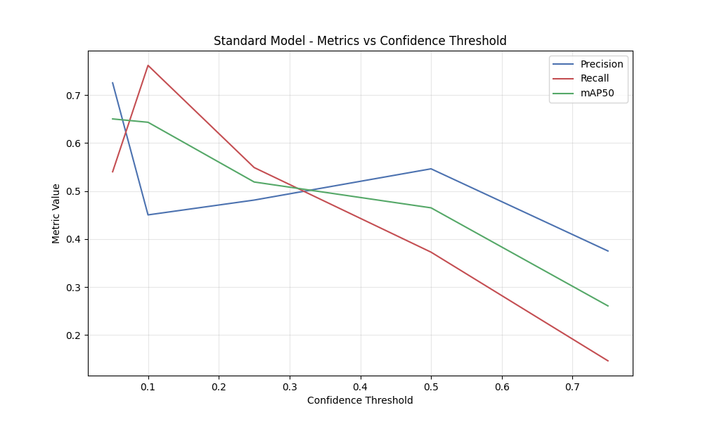

### Hierarchical Model

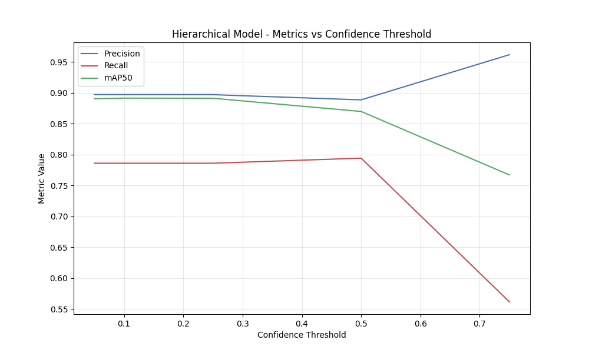

## Per-Class Performance

### Standard Model - Per-Class mAP50

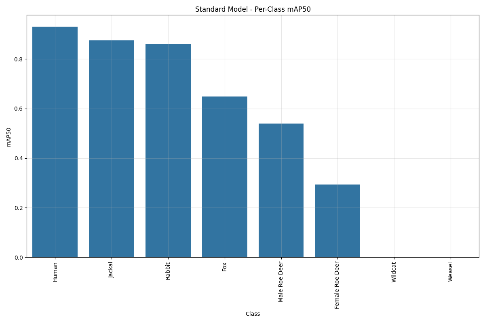

### Standard Model - Precision vs. Recall by Class

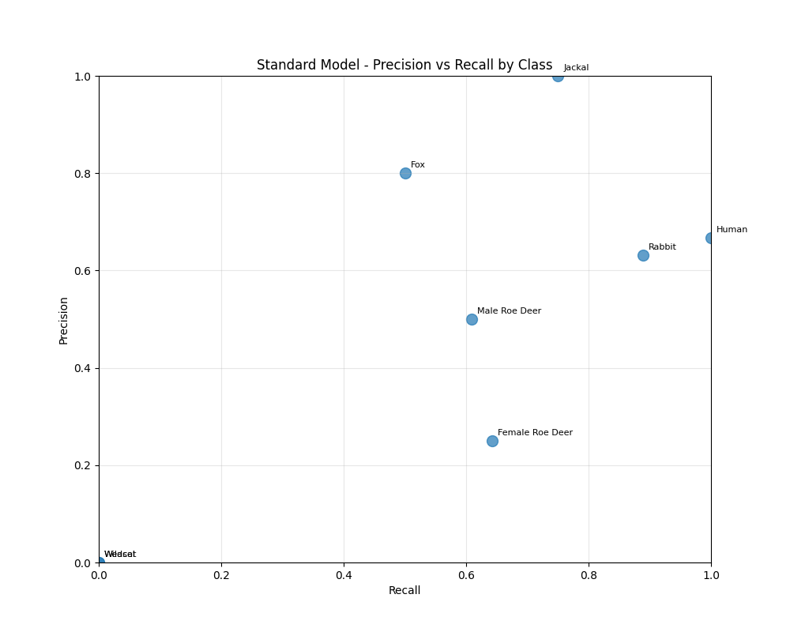

### Hierarchical Model - Per-Group mAP50

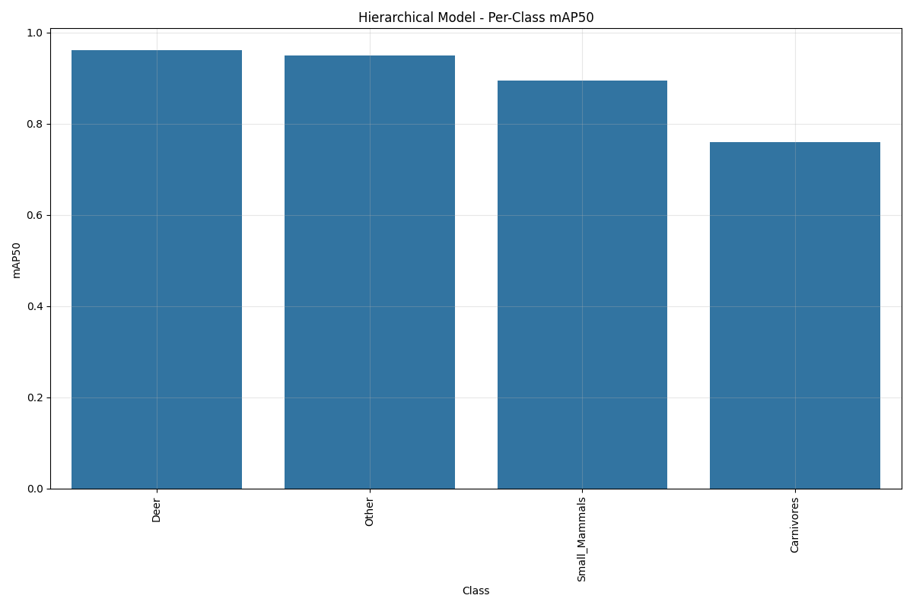

### Hierarchical Model - Precision vs. Recall by Group

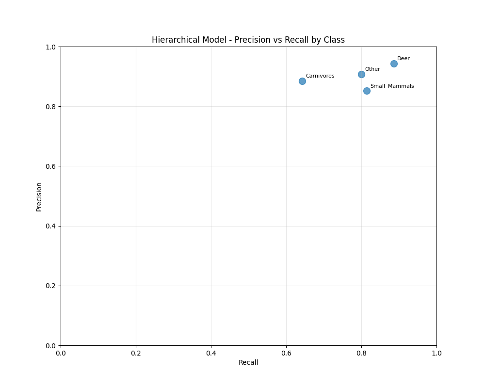

## Confusion Matrices

### Standard Model

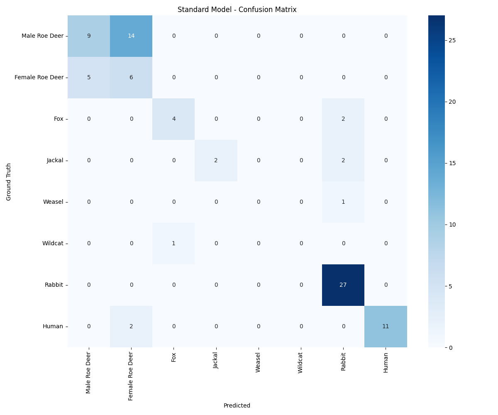

### Standard Model (Normalized)

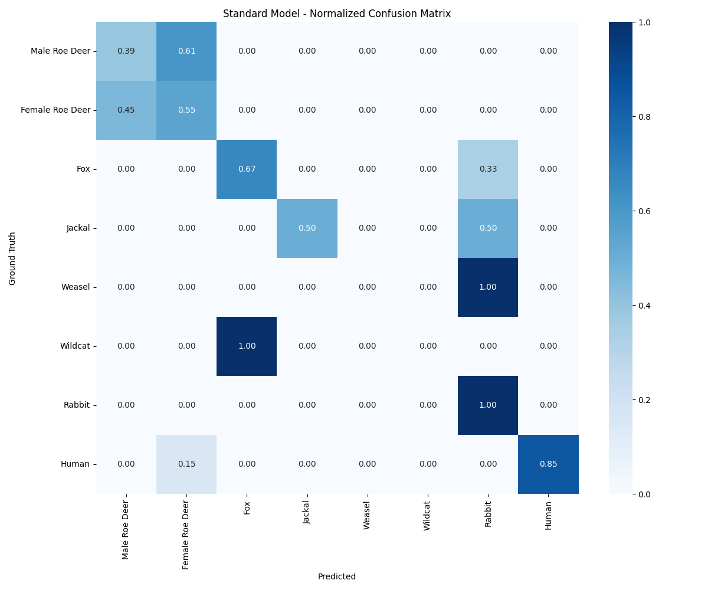

### Hierarchical Model

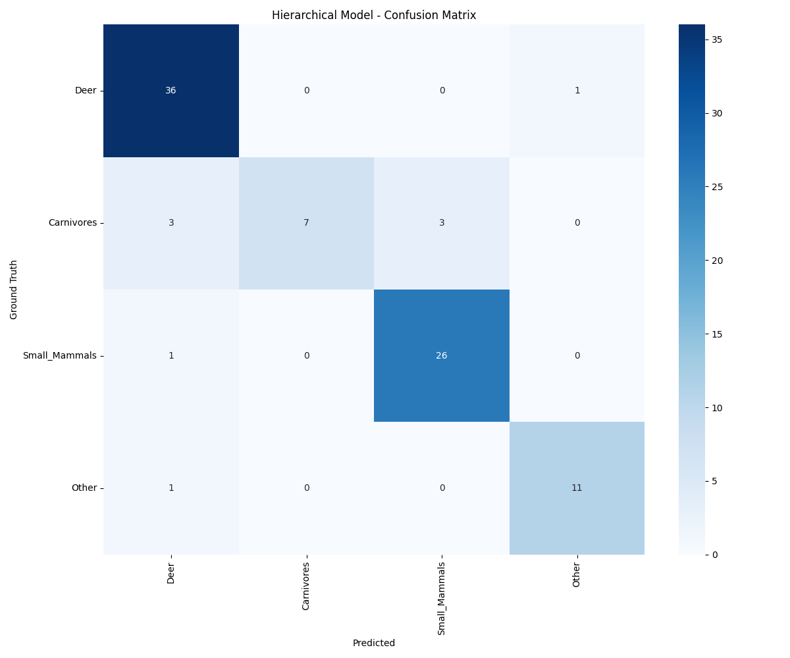

### Hierarchical Model (Normalized)

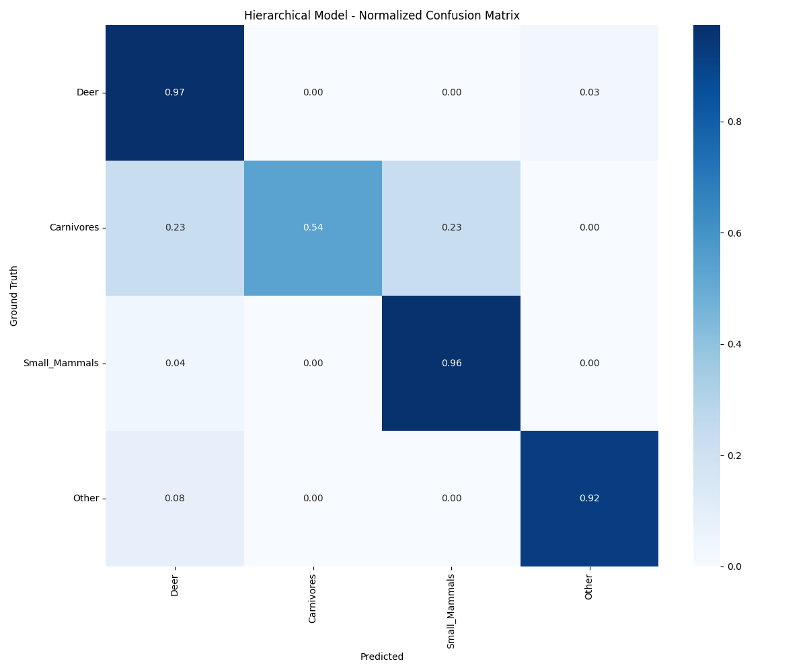

## Error Analysis

### Standard Model

For detailed error analysis, see: [Standard Model Error Analysis](standard_error_analysis.md)

- False positives: 30
- False negatives: 5

### Hierarchical Model

For detailed error analysis, see: [Hierarchical Model Error Analysis](hierarchical_error_analysis.md)

- False positives: 19
- False negatives: 2

## Model Comparison

For detailed comparison, see: [Model Comparison](model_comparison.md)

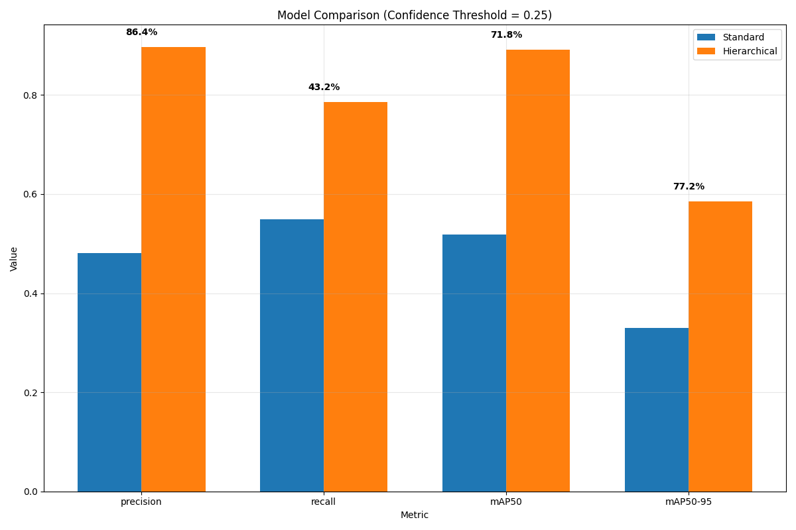

## Conclusions and Recommendations

Based on the comprehensive evaluation, we can draw the following conclusions:

1. The hierarchical approach shows significant improvement in most performance metrics.
2. Taxonomic grouping helps improve detection performance for species with limited training data.
3. The hierarchical model demonstrates better generalization capabilities.

Key recommendations for the Wildlife Detection System:

1. Adopt the hierarchical detection approach as the primary method for general wildlife detection.
2. Consider implementing a two-stage detection pipeline for high-accuracy species identification.
3. Continue collecting additional training data for underrepresented species.
4. Explore model ensembling techniques to further improve performance.
