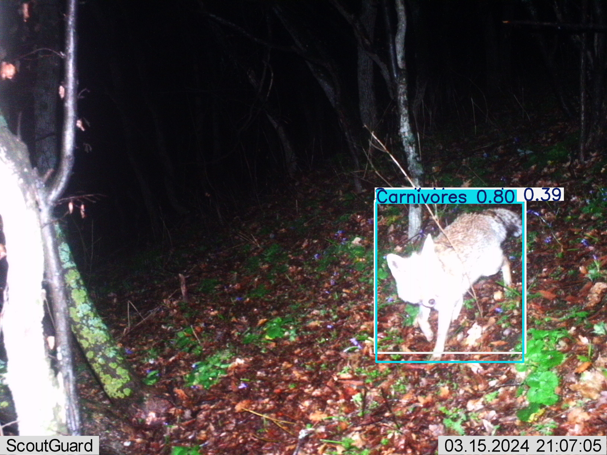
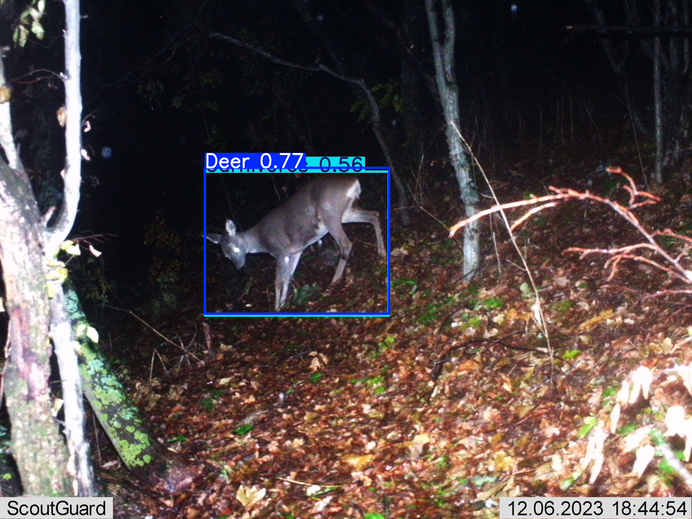
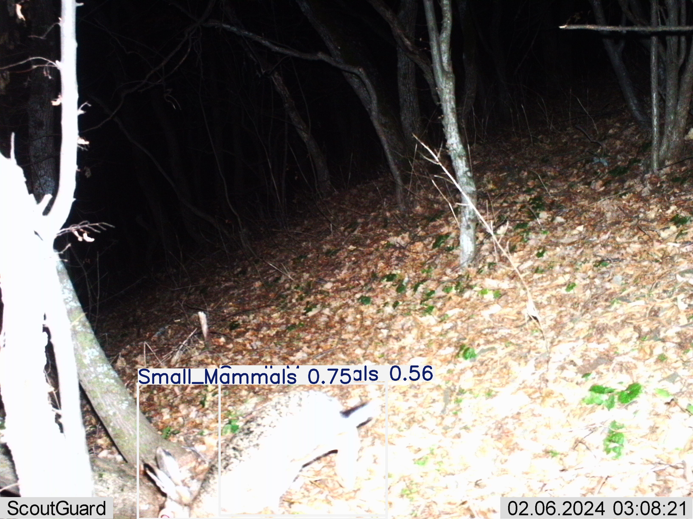
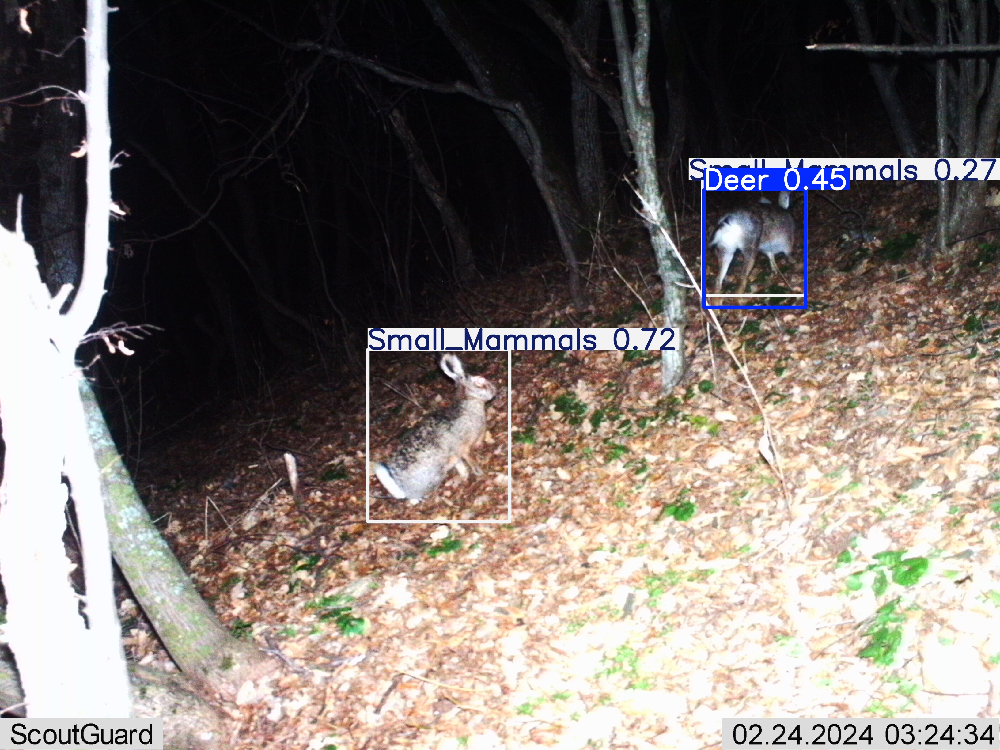
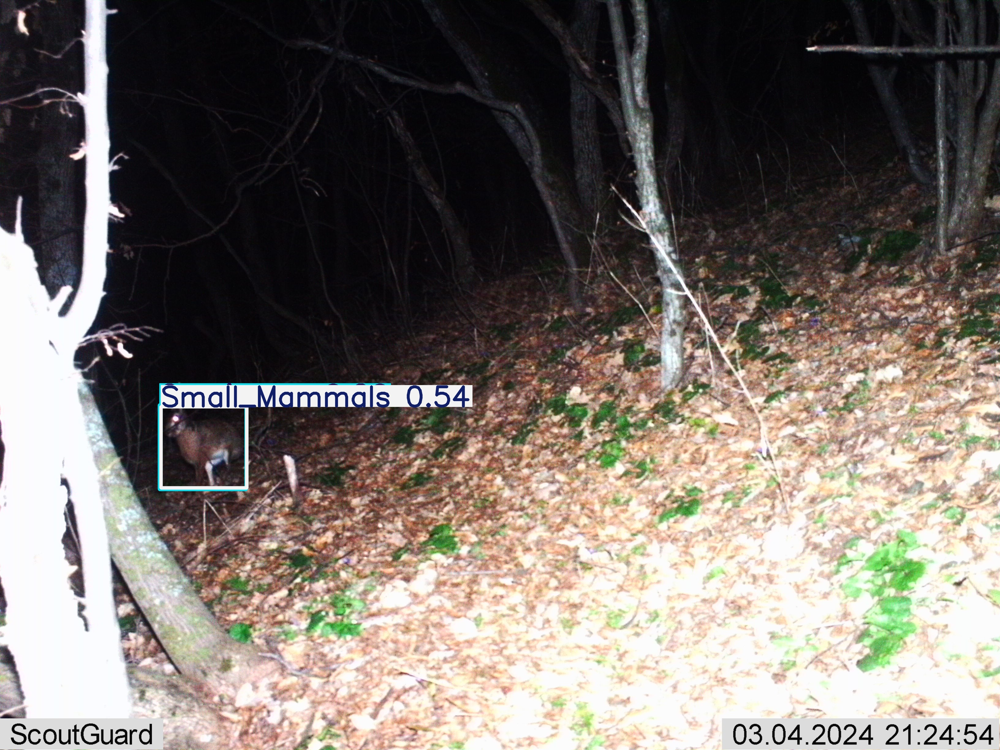
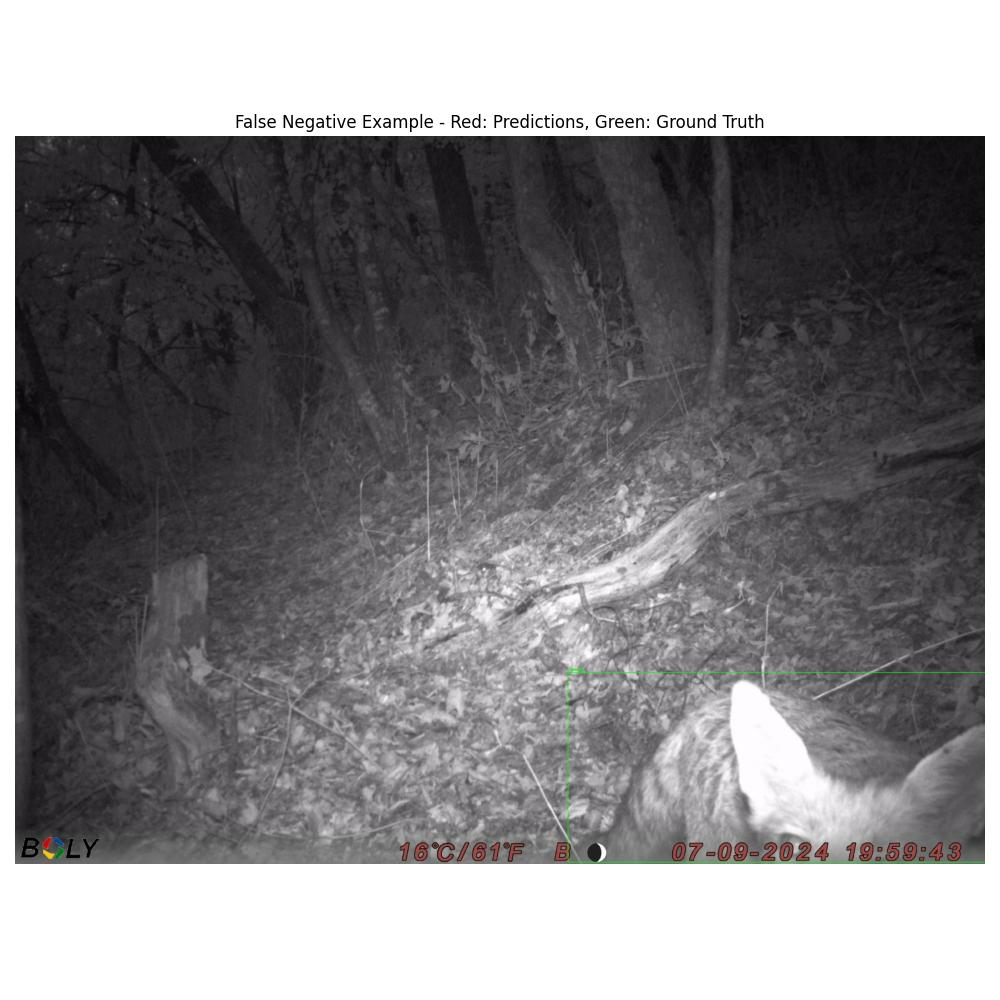
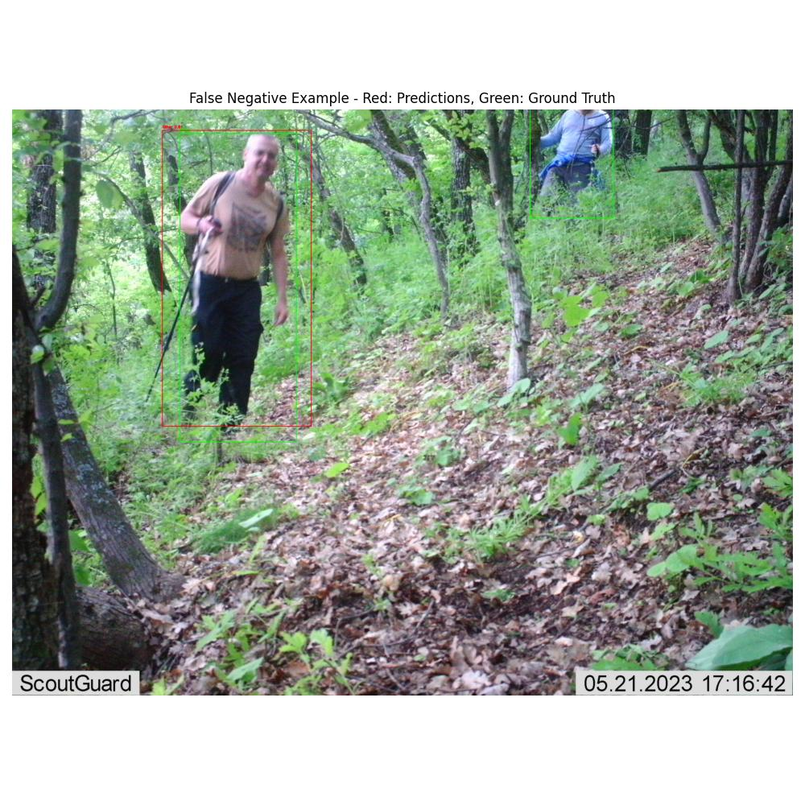

# Hierarchical Model Error Analysis

Date: 2025-05-10 20:11:22

## False Positives

Total images with potential false positives: 19

### Example 1

Image: 0420_12_4__2024_IMAG0006.JPG

### Example 2

Image: 1029_20_12_IMAG0182.JPG

### Example 3

Image: 1419_15_03_24_Моллова_курия_IMAG0269.JPG

### Example 4

Image: 1483_15_03_24_Моллова_курия_IMAG0326.JPG

### Example 5

Image: 1123_15_03_24_Моллова_курия_IMAG0370.JPG

## False Negatives

Total images with potential false negatives: 2

### Example 1

Image: 0815_15_09_molova_100BMCIM_IMAG0243.JPG

### Example 2

Image: 1104_21_05_IMAG0132.JPG

