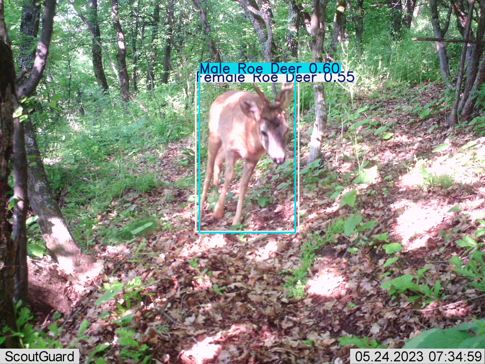
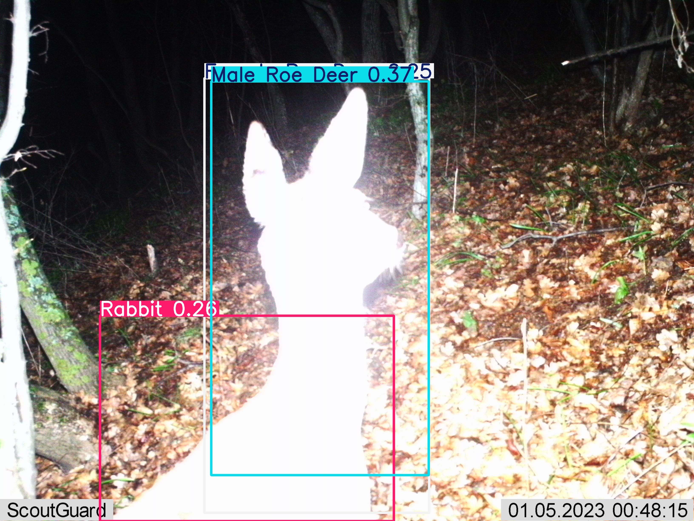
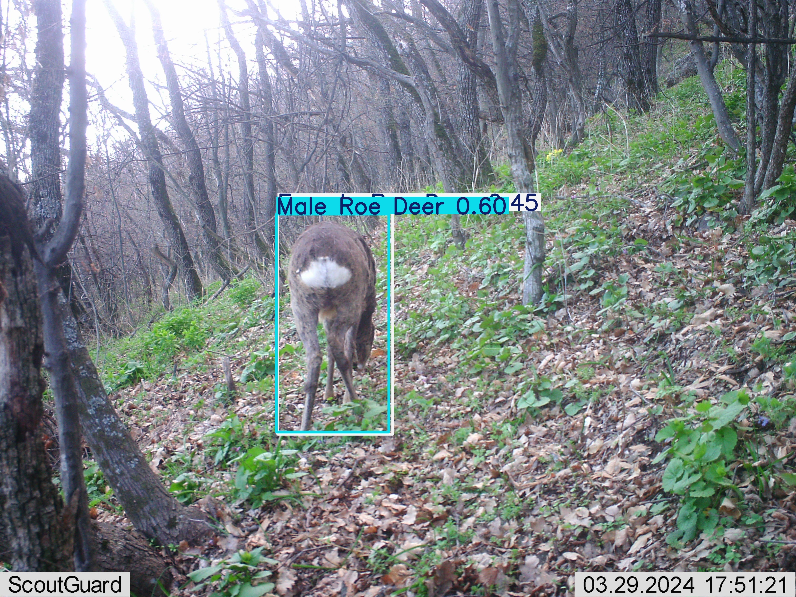
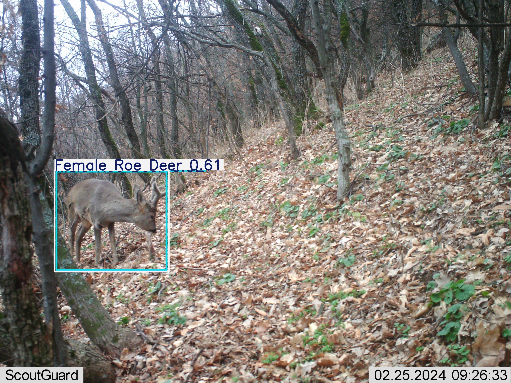
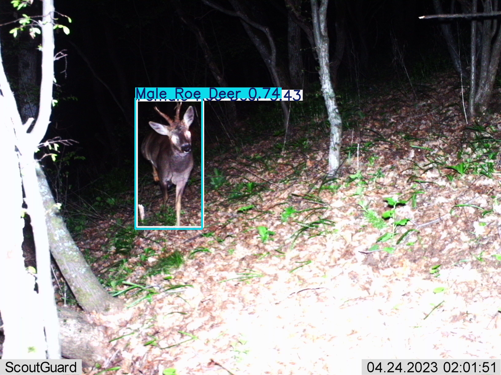
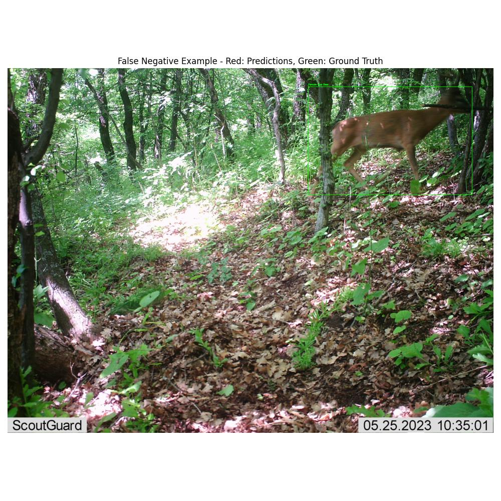
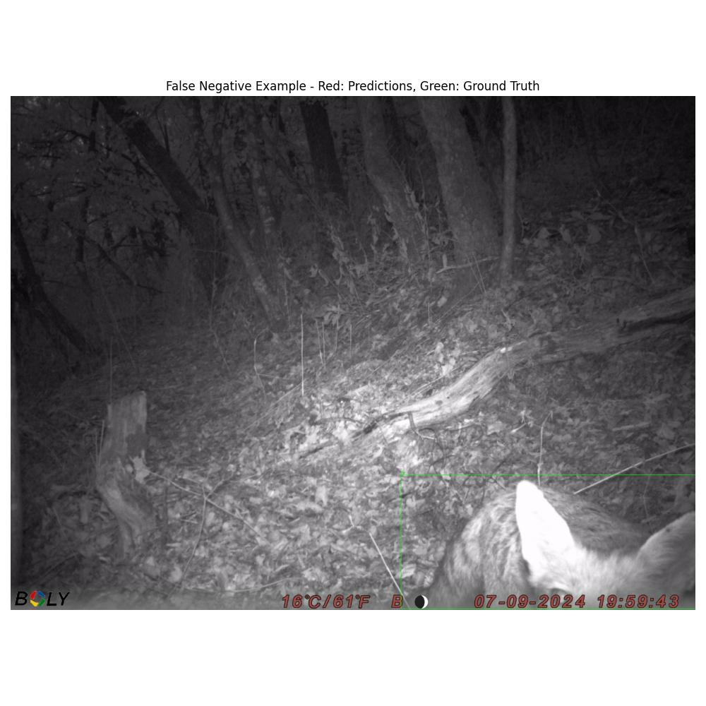
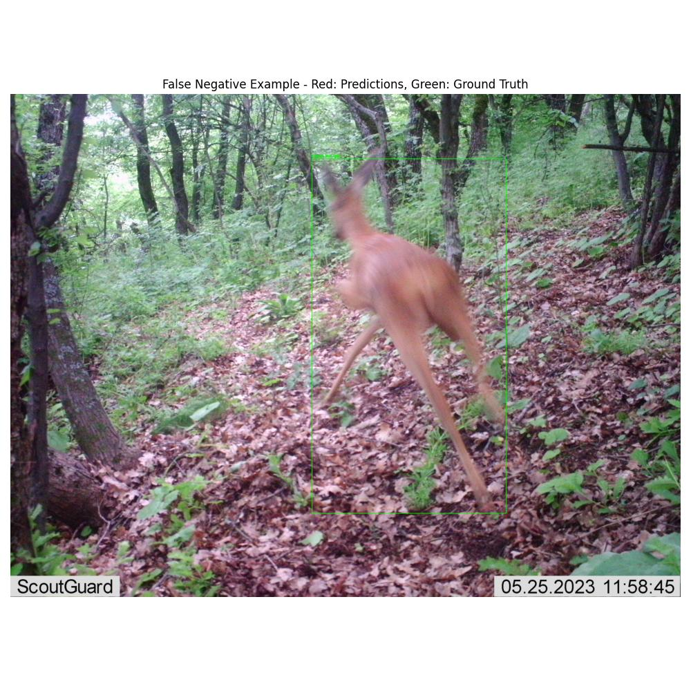
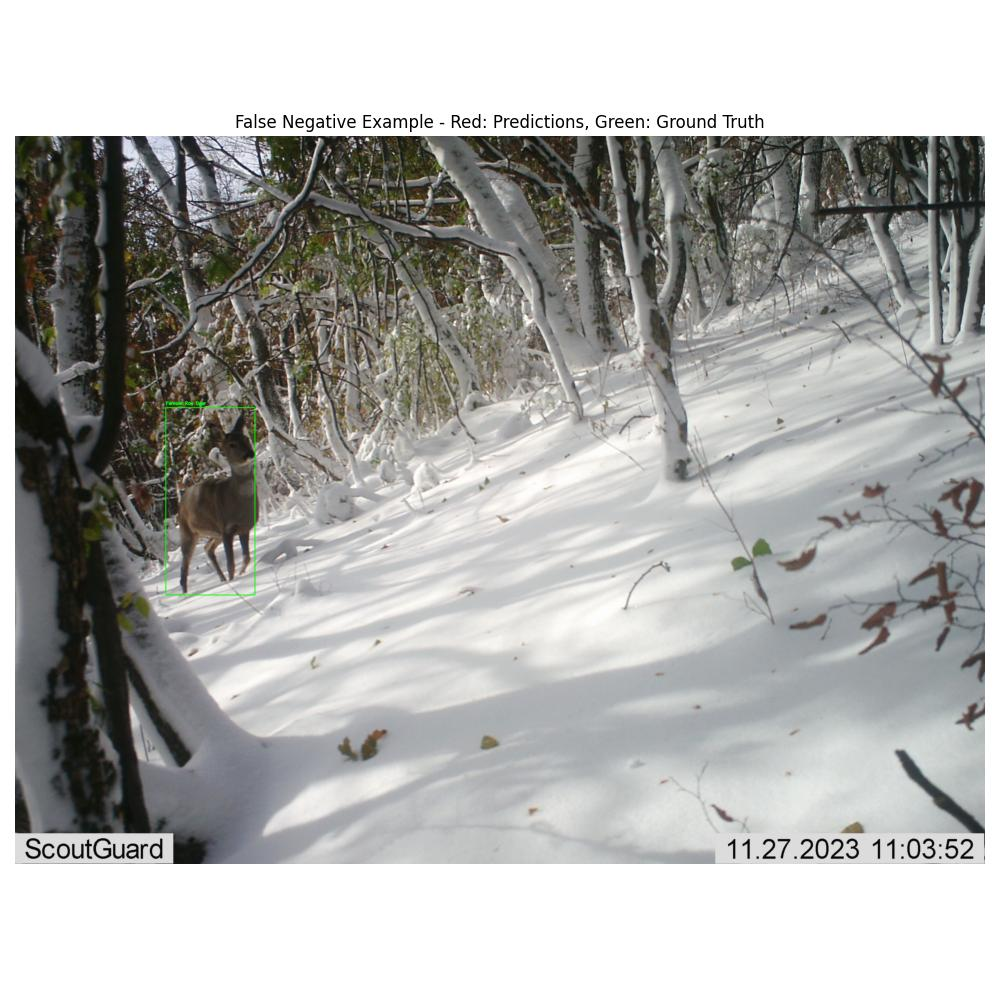
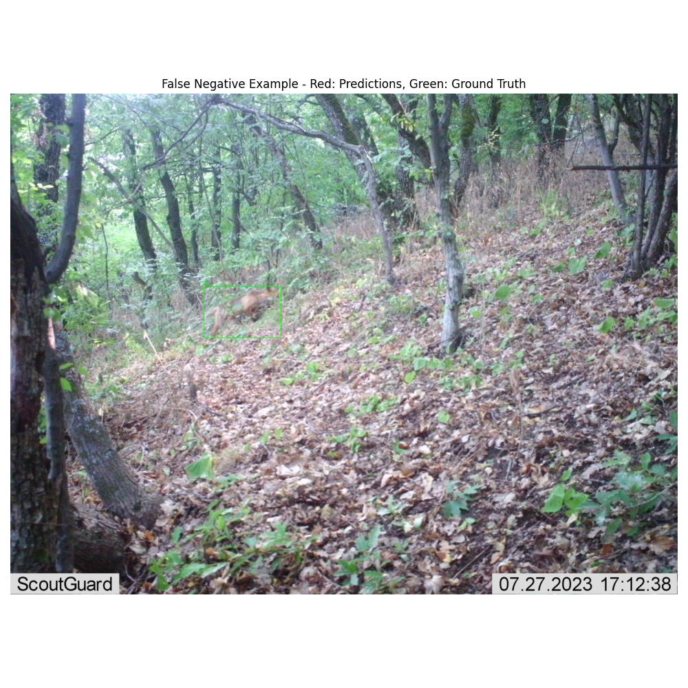

# Standard Model Error Analysis

Date: 2025-05-10 20:11:14

## False Positives

Total images with potential false positives: 30

### Example 1

Image: 0011_28_05_IMAG0148.JPG

### Example 2

Image: 0866_x_IMAG0021.JPG

### Example 3

Image: 0342_12_4__2024_IMAG0096.JPG

### Example 4

Image: 1488_15_03_24_Моллова_курия_IMAG0345.JPG

### Example 5

Image: 0784_30_04_100BMCIM_IMAG0044.JPG

## False Negatives

Total images with potential false negatives: 5

### Example 1

Image: 0006_28_05_IMAG0153.JPG

### Example 2

Image: 0815_15_09_molova_100BMCIM_IMAG0243.JPG

### Example 3

Image: 0021_28_05_IMAG0154.JPG

### Example 4

Image: 0921_20_12_IMAG0165.JPG

### Example 5

Image: 0083_11_09_100BMCIM_IMAG0024.JPG

